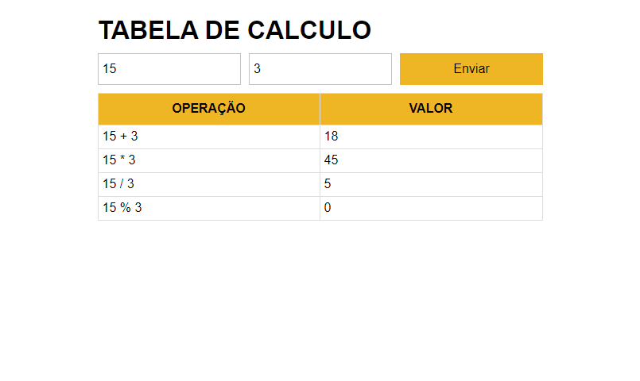
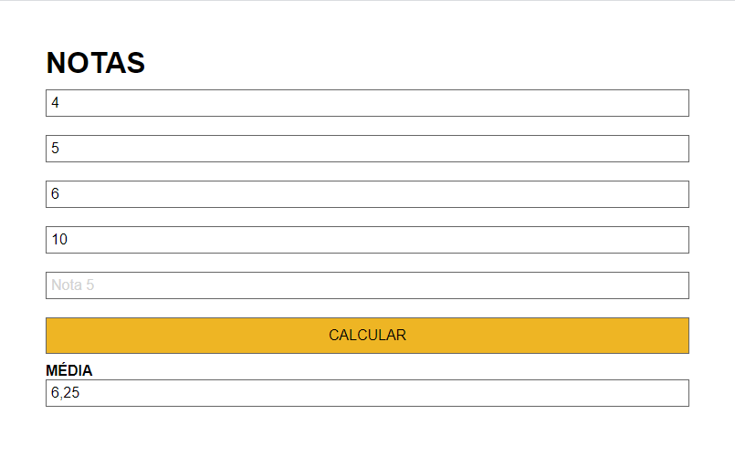
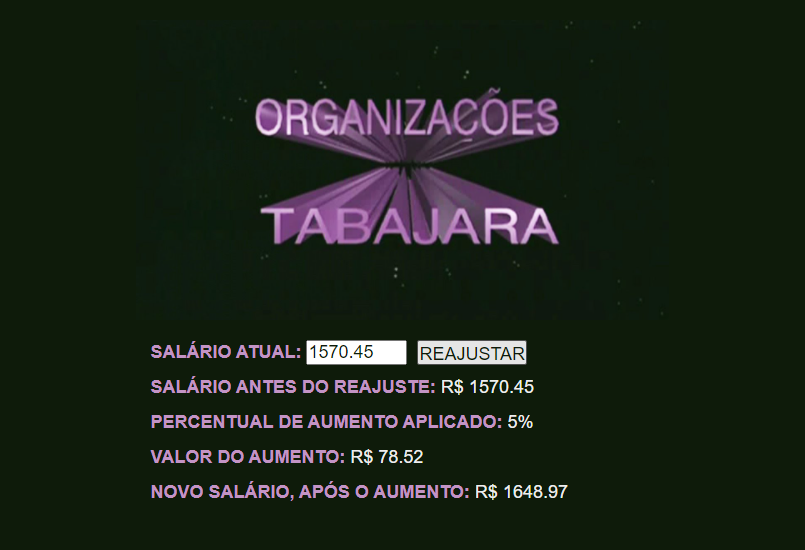
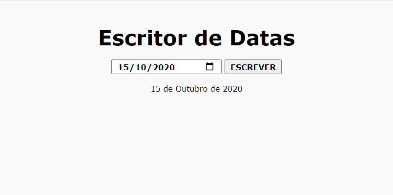
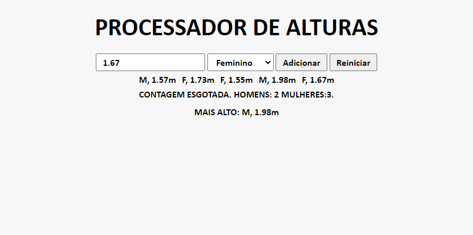
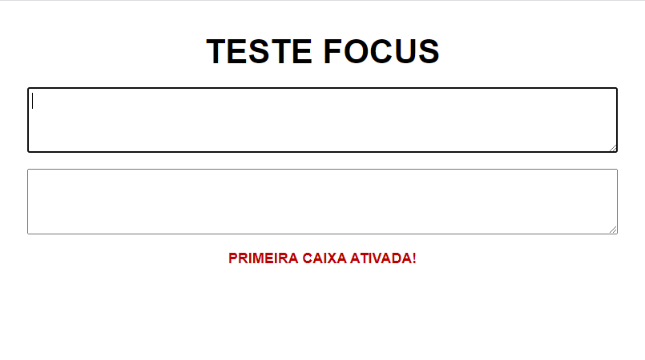
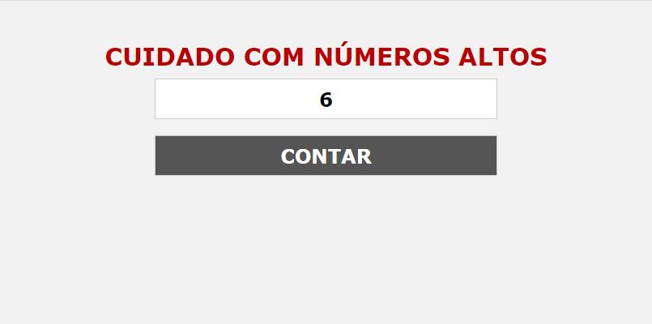

# javascript-list-1
List of exercises for training simple javascript.

## Exercise 1
Takes two inputs values as operators and writes the sum, multiplication, division and rest calculations in the table.

## Exercise 2
Take four or five input values and average the scores based on the values provided.

## Exercise 3
Calculates a salary readjustment based on the rule:
    -less than 280 increases 20%;
    -between 280 and 700 increases 15%;
    -between 700 and 1500 increases 10%;
    -greater than 1500 increases 5%.

## Exercise 4
Write the date with month in full.

## Exercise 5
Receive five entries containing a person's gender and height. After reading the five entries, it shows how many were men, how many were women and who was the tallest.

## Exercise 6
A large red button that displays an alert containing the message 'AIA' (?)

## Exercise 7
Displays a message when selecting the first text box and another one when losing focus.

## Exercise 8
Based on the input number, it displays a sequence of alerts with the message "AIA" followed by the counting number.

